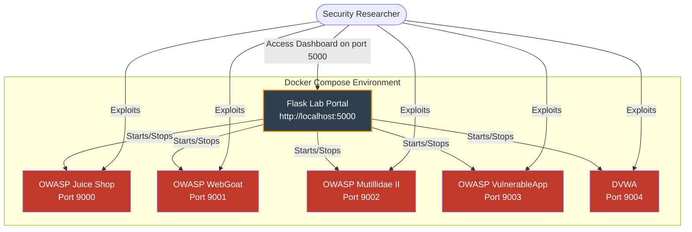

<div align="center">
  

  # 🛡️ OWASP Web Application Collection Lab

  **A centralized, containerized cyber range portal for managing popular deliberately vulnerable web applications.**<br>
  *This lab environment provides a sleek Flask-based dashboard to easily start, stop, and access various web vulnerability training applications locally using Docker Compose.*

  [](https://www.docker.com/)
  [](https://www.python.org/)
  [](#-included-applications)
</div>

---

## ⚠️ Security Warning
> [!CAUTION]
> **These applications are EXTREMELY VULNERABLE by design.**
> - Never deploy these applications on a production network or an exposed public server.
> - Use only on isolated/private networks or localhost.
> - They are intended for educational purposes and local security testing only.

---

## 🏗️ Architecture


---

## 🛠️ Prerequisites
| Requirement | Minimum |
|---|---|
| **Docker Engine** | ≥ 20.10 |
| **Docker Compose** | ≥ 2.0 |
| **Python** | ≥ 3.8 |
| **OS** | Linux, Windows (WSL2 / Docker Desktop), or macOS |

---

## 🚀 Installation & Deployment

### 🐧 Linux/macOS users:
```bash
# 1. Clone the project
git clone git@github.com:haltacademy/OWASP-Web-Application-Collection-Lab.git
cd OWASP-Web-Application-Collection-Lab

# 2. Deploy (automated)
./start_lab.sh
```

### 🪟 Windows users:
```powershell
# Open PowerShell
git clone git@github.com:haltacademy/OWASP-Web-Application-Collection-Lab.git
cd OWASP-Web-Application-Collection-Lab

# Create virtual environment and run the Flask portal
python -m venv .venv
.\.venv\Scripts\activate
pip install flask pyyaml
python app.py
```

> [!TIP]
> **Container Initialization**
> The portal manages the Docker containers dynamically. The images will be pulled in the background the first time you click "Start" on an application in the dashboard.

---

## 🌐 Included Applications
| Application | Port | Description |
|---|---|---|
| **`OWASP Juice Shop`** | `9000` | The most modern and sophisticated insecure web application. |
| **`OWASP WebGoat`** | `9001` | A deliberately insecure Java EE web application. |
| **`OWASP Mutillidae II`** | `9002` | A free, open-source web application deliberately designed to be vulnerable. |
| **`OWASP VulnerableApp`** | `9003` | A modular, deliberately vulnerable web app for benchmarking security tools. |
| **`DVWA`** | `9004` | A PHP/MySQL web application that is damn vulnerable. |

---

## 🔑 Access / Usage
1. **Access the Portal**: Open your browser and navigate to `http://localhost:5000`
2. **Login Credentials**:
   * **Username:** `owasp`
   * **Password:** `owasp`
3. **Manage Labs**: From the dashboard, click **"Start"** to initialize a vulnerable application. Once it's running, click **"Access"** to navigate to the application.

---

## 🧩 How to Add New Labs
You can easily add new containerized vulnerable apps by adding them to the `docker-compose.yml` file and including the necessary labels:

```yaml
  new_vulnerable_app:
    image: vendor/vulnerable-app:latest
    container_name: custom_app
    ports:
      - "9005:80"
    restart: unless-stopped
    labels:
      - "lab.name=My Custom Vuln App"
      - "lab.description=A description for the dashboard."
      - "lab.port=9005"
```
The Flask portal dynamically reads these labels to populate the dashboard without requiring code changes.

---

## 🧹 Cleanup
To shut down all running vulnerable applications and the portal:
1. Stop any running labs from the portal dashboard.
2. Terminate the Flask application (`Ctrl+C` in your terminal).
3. To aggressively remove all lab containers, run:
   ```bash
   docker compose down
   ```

<br>
<div align="center">
  <i>Created for educational and authorized penetration testing training only.</i>
</div>
